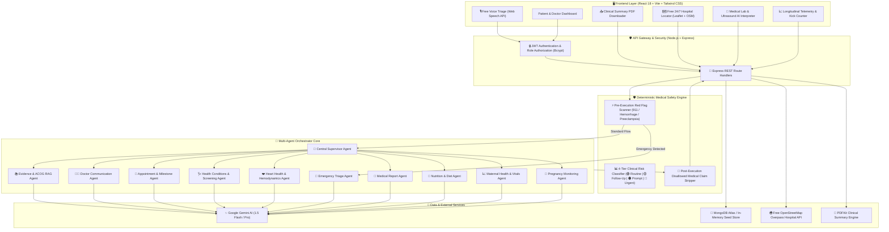

# 🌸 MotherSync AI — Clinical Multi-Agent Maternal Healthcare Platform

<div align="center">


[](https://opensource.org/licenses/MIT)
[](https://nodejs.org/)
[](https://reactjs.org/)
[](https://vitejs.dev/)
[](https://tailwindcss.com/)
[](https://ai.google.dev/)
[](https://www.mongodb.com/)

**An AI-native maternal health monitoring and care coordination platform powered by a central Supervisor Agent, 10 clinical specialist domain agents, a deterministic medical safety engine, and longitudinal maternal-fetal telemetry.**

[Features](#-key-capabilities) • [Architecture](#-system-architecture) • [Multi-Agent System](#-10-specialized-clinical-domain-agents) • [Safety Engine](#-deterministic-medical-safety-engine) • [API Reference](#-api-endpoints) • [Quickstart](#-getting-started)

</div>

---

## 🏗️ System Architecture

MotherSync AI is structured around a **multi-agent orchestration architecture** coupled with a **pre- and post-execution deterministic medical safety verification pipeline**.



---

## 🌟 Key Capabilities

### 1. 🤖 10 Specialized Clinical Domain Agents + Supervisor
* **Supervisor Orchestrator Agent:** Classifies user intent dynamically, delegates queries to domain specialists, and enforces safety guardrails.
* **Pregnancy Monitoring Agent:** Gestational age milestones, developmental timeline, and baby size analogies.
* **Maternal Health Agent:** Longitudinal blood pressure, heart rate, glucose, weight, and symptom surveillance.
* **Nutrition Agent:** Trimester-tailored diet plans, micronutrients (iron, folate, calcium, DHA), and food safety.
* **Medical Report Agent:** Optical and text analysis of ultrasounds, CBC panels, and glucose tolerance tests with plain-language explanations.
* **Emergency Triage Agent:** Immediate red-flag detection, urgent clinical directives, and hospital emergency dispatch.
* **Heart Health Agent:** Maternal hemodynamic adaptation, resting pulse tracking, and cardiovascular safety.
* **Health Conditions Agent:** Surveillance for gestational hypertension, preeclampsia, gestational diabetes (GDM), and anemia.
* **Appointment Agent:** Prenatal calendar, milestone test schedule (OGTT, Tdap, Anatomy Scan), and reminders.
* **Doctor Communication Agent:** Generates "Prepare for My Appointment" personalized questions for obstetrician visits.
* **Knowledge / RAG Agent:** Authoritative evidence retrieval grounded in **ACOG, WHO, SMFM & CDC guidelines**.

### 2. 🛡️ Deterministic Medical Safety Engine
* **4-Tier Clinical Risk Matrix:**
  * 🟢 **Routine Monitoring:** Normotensive, stable heart rate, expected physiological milestones.
  * 🟡 **Follow-Up Recommended:** Minor isolated symptoms, borderline ferritin or fasting glucose.
  * 🟠 **Prompt Medical Evaluation:** Elevated BP (130-139 / 85-89 mmHg), decreased fetal movement, persistent vomiting.
  * 🔴 **Urgent Medical Attention (Red Alert):** BP $\ge$ 140/90 or 160/110 mmHg, acute hemorrhage, preeclampsia triad, chest distress.
* **Zero-Hallucination Guardrails:** Automatically intercepts prohibited definitive diagnoses and appends clinical educational disclaimers.

### 3. 🗺️ Free 24/7 Maternity Hospital & Emergency Locator
* Real-time proximity search using the **OpenStreetMap Overpass API** and **Leaflet** with zero paid map keys required.
* Calculates distance in kilometers and miles, provides direct phone links to maternity units, and launches turn-by-turn Google Maps navigation.

### 4. 🎙️ 100% Free Voice Emergency Triage
* Leverages native browser **Web Speech API** for real-time speech-to-text with no paid third-party speech subscriptions.
* Immediately analyzes voice input through the Emergency Triage Agent and automatically launches the fullscreen **Red Alert SOS Modal** upon high-risk detection.

### 5. 📄 Medical Reports & Instant PDF Summary Export
* Upload and parse lab reports (ultrasounds, CBC, iron panels, OGTT) into structured parameter tables with normal/abnormal badges.
* One-click generation and streaming download of an official **Clinical Telemetry & Visit Summary PDF** via **PDFKit**.

### 6. 🔒 JWT Authentication & Dual-Role Support
* Secure password hashing with **Bcrypt** and signed **JSON Web Tokens (JWT)**.
* Built-in **1-Click Demo Evaluation** for both **Elena Vance (Patient)** and **Dr. Sarah Jenkins, MD (Doctor)**.

---

## 📁 Project Structure

```
MotherSync AI/
├── 📂 backend/                  # Express REST API & Multi-Agent Engine
│   ├── 📂 src/
│   │   ├── 📂 agents/          # 10 Domain Specialist Agents + Supervisor
│   │   ├── 📂 config/          # MongoDB & In-Memory Offline Store Fallback
│   │   ├── 📂 middleware/      # JWT Authentication & Role Authorization
│   │   ├── 📂 models/          # Data Models (Vitals, Reports, Appointments, Emergency)
│   │   ├── 📂 routes/          # REST Route Handlers (Auth, Agents, Records, PDF, etc.)
│   │   ├── 📂 services/        # Safety Engine, Gemini AI, PDF Kit, Hospital Discovery
│   │   └── server.js           # Server Entrypoint (Port 5000)
│   ├── .env                    # Environment Variables
│   └── package.json
│
├── 📂 frontend/                 # React 18 + Vite + Tailwind CSS Application
│   ├── 📂 src/
│   │   ├── 📂 components/      # UI Widgets (VitalsChart, KickCounter, RiskBadge, VoiceTriage)
│   │   ├── 📂 context/         # AuthContext & EmergencyModalContext
│   │   ├── 📂 pages/           # Dashboard, Multi-Agent Studio, Vitals, Reports, Hospitals, Doctor
│   │   ├── 📂 services/        # Centralized Axios API Client
│   │   ├── App.jsx             # Main Navigation & Routing
│   │   ├── index.css           # Tailwind Tokens & Glassmorphism Styles
│   │   └── main.jsx
│   ├── index.html
│   ├── vite.config.js
│   ├── tailwind.config.js
│   └── package.json
│
└── README.md
```

---

## 📡 API Endpoints

| Method | Endpoint | Description |
| :--- | :--- | :--- |
| `POST` | `/api/auth/register` | Register new pregnant mother or clinician |
| `POST` | `/api/auth/login` | Authenticate user and receive JWT token |
| `POST` | `/api/auth/demo-login` | Instant 1-click test login (`patient` or `doctor`) |
| `GET` | `/api/auth/profile` | Get current authenticated user profile |
| `POST` | `/api/agents/chat` | Send user message to Supervisor Agent for routing & response |
| `POST` | `/api/agents/voice-triage`| Process voice transcript through Emergency Triage Agent |
| `POST` | `/api/agents/prepare-questions`| Generate tailored doctor visit questions |
| `GET` | `/api/health-records` | Retrieve longitudinal vitals telemetry and current risk status |
| `POST` | `/api/health-records` | Log blood pressure, heart rate, glucose, kicks, and symptoms |
| `POST` | `/api/health-records/kick` | Log interactive kick counter session |
| `GET` | `/api/reports` | Get all uploaded diagnostic lab reports |
| `POST` | `/api/reports/analyze` | AI extraction and plain-language analysis of medical report |
| `POST` | `/api/reports/:id/doctor-review` | Physician adds clinical review notes to report |
| `GET` | `/api/appointments` | Get scheduled prenatal appointments and milestone tests |
| `POST` | `/api/appointments` | Schedule a new prenatal appointment |
| `GET` | `/api/hospitals/nearby` | Find nearby 24/7 maternity facilities via free OpenStreetMap |
| `POST` | `/api/emergency/sos` | Trigger One-Touch Emergency SOS and notify contacts |
| `GET` | `/api/doctor/patients` | Doctor view: List monitored patients and telemetry flags |
| `GET` | `/api/doctor/patient/:id`| Doctor view: Detailed patient clinical dossier |
| `GET` | `/api/pdf/summary` | Generate and download official Clinical Summary PDF |
| `GET` | `/api/health` | Service health check endpoint |

---

## 🚀 Getting Started

### Prerequisites
* **Node.js**: v18.0.0 or higher
* **Git**

### Installation

1. **Clone the repository:**
   ```bash
   git clone https://github.com/SiddharthK1257/MotherSync-AI.git
   cd MotherSync-AI
   ```

2. **Configure Environment Variables:**
   Create a `backend/.env` file with the following:
   ```env
   PORT=5000
   NODE_ENV=development
   JWT_SECRET=your_jwt_secret_key_here
   GEMINI_API_KEY=your_gemini_api_key_here
   MONGODB_URI=mongodb+srv://<username>:<password>@cluster0.o15xdof.mongodb.net/?appName=Cluster0
   ```

3. **Install Dependencies:**
   ```bash
   # Install Backend Dependencies
   cd backend
   npm install

   # Install Frontend Dependencies
   cd ../frontend
   npm install
   ```

4. **Run the Application:**

   **Terminal 1 — Backend:**
   ```bash
   cd backend
   npm start
   ```
   *Active at:* `http://localhost:5000` *(Health Check: `http://localhost:5000/api/health`)*

   **Terminal 2 — Frontend:**
   ```bash
   cd frontend
   npm run dev
   ```
   *Active at:* `http://localhost:5173`

---

## ⚡ Instant Demo Credentials

The platform includes frictionless 1-click evaluation:
* **Pregnant Mother Profile:** `elena@mothersync.ai` • Elena Vance (Week 24 Pregnant, Second Trimester)
* **Obstetrician Profile:** `doctor@mothersync.ai` • Dr. Sarah Jenkins, MD (FACOG) (St. Jude Maternal-Fetal Medicine)

---

## 📜 Medical Disclaimer

> **MotherSync AI** is an educational tracking, multi-agent analysis, and clinical care coordination platform designed to support pregnant mothers and their healthcare teams. It is **NOT** a diagnostic medical device and does not substitute for the professional clinical judgment of an obstetrician, nurse midwife, or emergency medical services. In the event of acute pain, bleeding, fluid leaking, or severe symptoms, seek immediate emergency medical care.

---

## 📄 License

This project is licensed under the MIT License — see the [LICENSE](LICENSE) file for details.
